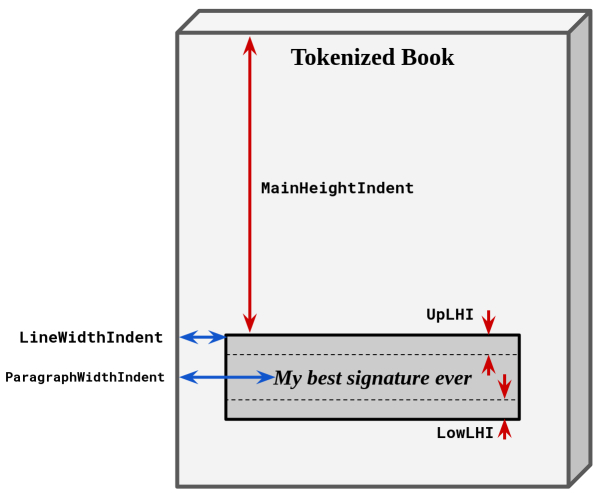

# core-svc

## Description

The core service responsible for generating NFTs.

Service includes API endpoints for tasks – small state machines, where the first step is to prepare a book with user's custom signature and load it to the S3 bucket. The frontend side waits till the task receives `finished_generation` status. After that, the frontend gets an EIP712 Mint signature needed to send a transaction to mint token. For EIP712, we use a `price-svc` connector to get the proper amount of tokens per 1$ (NOT per book price in USD).

When the token is minted, `contract-tracker` updates the task info (e.g., `status` and `token_id`) and creates a token object which contains an info such as book id, signature, owner, IPFS hash, etc.

PDF params (`pdf_signature_params` in the `config.yaml`) explanation:



## Install

  ```bash
  git clone generator-svc
  cd generator-svc
  go build main.go
  export KV_VIPER_FILE=./config.yaml
  ./main migrate up
  ./main run service
  ```

## Documentation

We do use openapi:json standard for API. We use swagger for documenting our API.

To open online documentation, go to [swagger editor](http://localhost:8080/swagger-editor/) here is how you can start it
```bash
  cd docs
  npm install
  npm start
```
To build documentation use `npm run build` command,
that will create open-api documentation in `web_deploy` folder.

To generate resources for Go models run `./generate.sh` script in root folder.
use `./generate.sh --help` to see all available options.


## Running from docker

Make sure that docker is installed. Use `docker run ` with `-p 8080:80` to expose port 80 to 8080

```bash
docker build -t generator-svc .
docker run -e KV_VIPER_FILE=/config.yaml generator-svc
```

## Running from Source

* Set up environment value with config file path `KV_VIPER_FILE=./config.yaml`
* Provide valid config file
* Launch the service with `migrate up` command to create database schema
* Launch the service with `run service` command


### Database
For services, we do use ***PostgresSQL*** database.
You can [install it locally](https://www.postgresql.org/download/) or use [docker image](https://hub.docker.com/_/postgres/).


### Third-party services
- [UniPDF](https://github.com/unidoc/unipdf): service for modifying PDFs

## Contact

The primary contact for this project is `@slbmax` (_Telegram_) and Dmytro Zakharov `@ZamDimon` (_Telegram_ as well)
